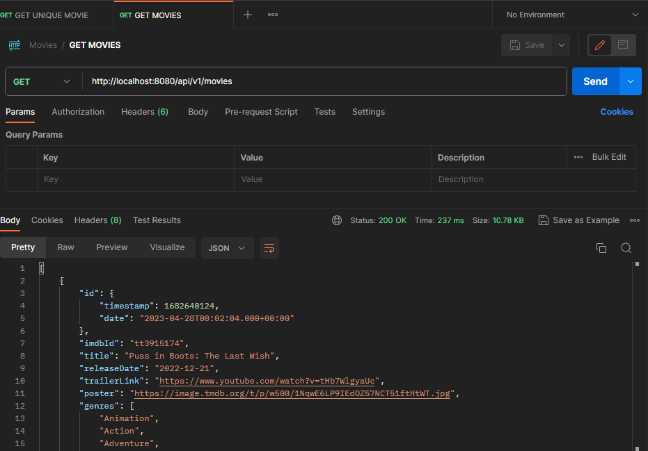
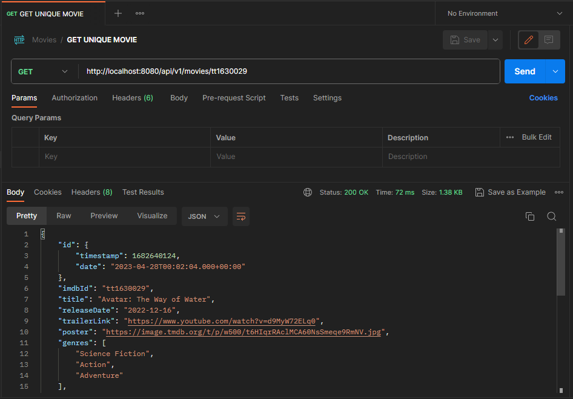

# Front-end repository: 
<a href="https://github.com/CassRamos/movies_app_frontend" target="_blank"> Click here to check out the React front-end of this project</a>
 
 

<h1 align="center"> Movies </h1>

  

  <a href="#-tecnologies">Technologies</a>&nbsp;&nbsp;&nbsp;|&nbsp;&nbsp;&nbsp;
  <a href="#-project">Project</a>&nbsp;&nbsp;&nbsp;|&nbsp;&nbsp;&nbsp;
  <a href="#memo-license">License</a>
  

  

This repository is a back-end file of movies application 

 

### Front-end is not running:

 If you don't run the front-end, nothing will be rendered on your localhost: 

 

## 🚀 Tecnologies

This project was developed with the following technologies:

- Java & Spring Framework 🍃
- MongoDB 
- Postman 
- Git & Github 
 

## 💻 Project

Movies is an app responsible for showing the images and trailers of some movies on a carousel and provides a page to add reviews for an exclusive movie. 

In this file  will be presented the model of entities will that make up the database and some tests on postman to verify the endpoints are working

## :memo: License

This project is under license from MIT

 

# Getting Started 

## Available Scripts

In the project directory, you can run the application using the shortcut Shift + F10, something similar to this will occur in your IDE:

  

 

## Mongo DB

 After you create a cluster and initialized a database in mongoDB you will put movies in object format, something like: 

  

 Something similar to movies is applied to the review database: 

  

 
 

## Endpoints 

To test the application endpoints you can use the Postman, HttpPie, Insomnia...

 

### Get all movies

 To fetch all movie data, you'll use: 

  

 

### Get a single movie

 To fetch data from a single movie, you'll use a similar endpoint passing the movie id: 

  

 

### Post a review

 To post a review in database, you'll use the JSON format and the endoint below 

  

 

 When the entire application is running, the communication with the API is perfomed on your localhost: 

  

  

Thanks for your attention, see you next time 💜

